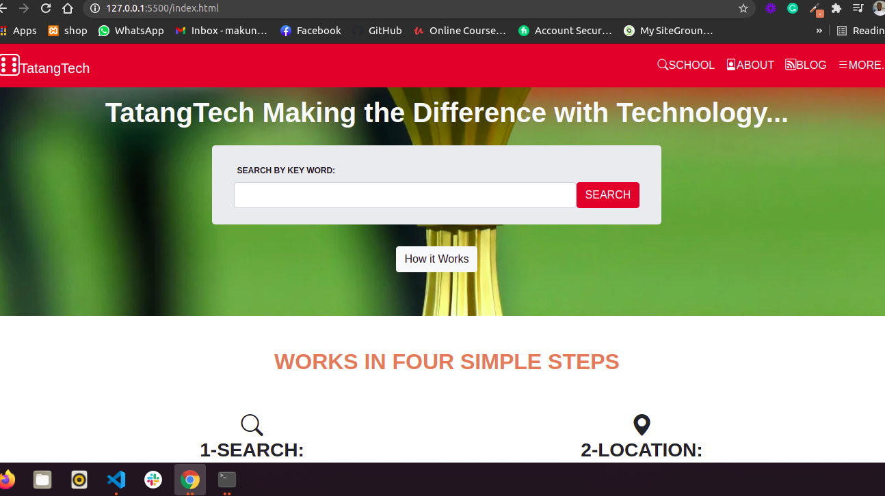

# Directory_of_Schools

## Capstone Project: Online shop for electronics

 This project is a supposed School Directory web application use to display the school content . It consists of three pages and is responsive to mobile and desktop screens.

This project features HTML5 semantic tags, CSS and Bootstrap.

## Built With

- HTML5, CSS3 and BOOTSTRAP

## Live Demo

[Live Demo Link](https://collinstatang.github.io/Directory_of_Schools/)

### Prerequisites

Knowledge of HTML Semantics CSS And BOOTSTRAP

## Author

👤 **Makungong Collins Tatang**

- GitHub: [@CollinsTatang](https://github.com/CollinsTatang)
- Twitter: [@CollinsTatang1](https://twitter.com/CollinsTatang1)
- LinkedIn: [makungong-collins](https://www.linkedin.com/in/makungong-collins-b43260190/)

## 🤝 Contributing

Contributions, issues, and feature requests are welcome!

Feel free to check the [issues page](https://github.com/CollinsTatang/Directory_of_Schools/issues).

## Show your support

Give a ⭐️ if you like this project!

## Acknowledgments

- [Collins Tatang](https://www.notion.so/HTML-CSS-capstone-project-Directory-of-Schools-eea352bfaf3e4a83b2917df1f9a4e140) for the project guidelines.
- [Microverse](https://www.microverse.org/) for their `README` [template](https://github.com/microverseinc/readme-template).

## 📝 License

This project is [Microverse](https://www.microverse.org/) licensed.
